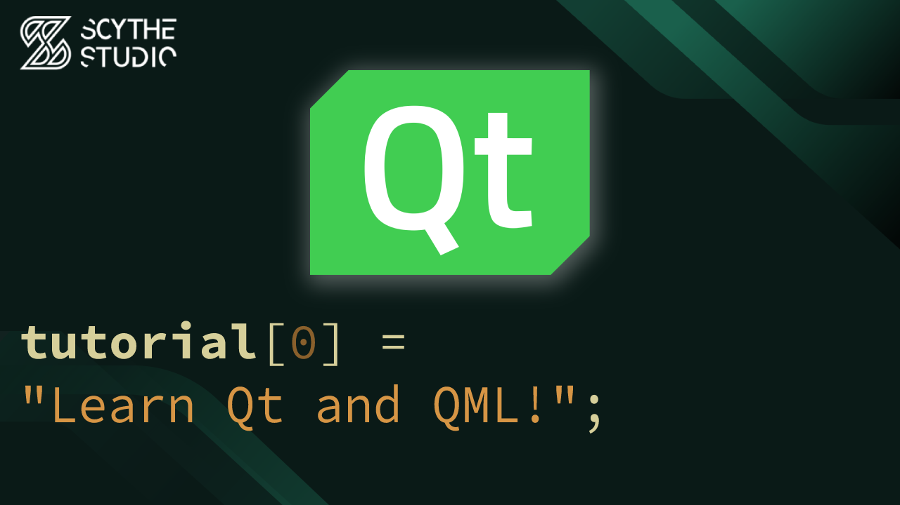

# Learn Qt and QML! - Qt QML Tutorial #0

## Episode Purpose
In this introductory episode, we'll provide an overview of the course and what you can expect to learn.

We believe in giving back to the community and providing a launching pad for those who aspire to build their skills and create great software. Throughout this series, we'll explore various concepts, build projects, and unravel the beauty of Qt.

The course content includes a wide range of topics that will equip you with the necessary knowledge and skills. 

Throughout the series, we'll cover essential concepts like communication mechanisms with Signals and Slots, the structure of Qt objects, and the power of QML for user interface design. You'll also learn how to integrate C++ with QML to bring logic into your applications.

As we conclude the series, we'll provide guidance on the path forward, helping you continue your growth and learning in Qt QML development. We'll point you to additional resources and show you how to make the most of them.

Episode Link: **[YT LINK]**

## Code Short Description
No coding this time :)

## About Scythe Studio
We are a group of Qt and C++ enthusiasts whose goal is to address growing demand for cross-platform Qt development services. Thanks to our expertise in **Qt Qml development**, quality of deliveries and proven track of projects developed for companies from various industries we have been awarded the title of an official **Qt Service Partner**.

 

The company offers broad spectrum of services for the clients who wish to bring their ideas to life. We have extensive and practical knowledge about various Qt modules and other technologies allowing to create high quality product in a cost effective approach. If you want to see what Scythe Studio is is capable of and what services we provide, check out [this link](https://scythe-studio.com/en/services).

## Follow us

Check out those links if you want to see Scythe Studio in action and follow the newest trends saying about Qt Qml development.

* 🌐 [Scythe Studio Website](https://scythe-studio.com/en/)
* ✍️  [Scythe Studio Blog Website](https://scythe-studio.com/en/blog)
* 👔 [Scythe Studio LinkedIn Profile](https://www.linkedin.com/company/scythestudio/mycompany/)
* 👔 [Scythe Studio Facebook Page](https://www.facebook.com/ScytheStudiio)
* 🎥 [Scythe Studio Youtube Channel](https://www.youtube.com/channel/UCf4OHosddUYcfmLuGU9e-SQ/featured)