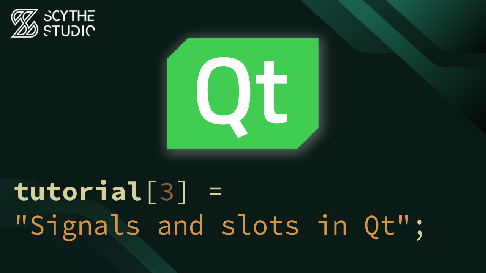

# Signals and slots in Qt - Qt QML Tutorial #3

## Episode Purpose
In this episode, we will explore the concept of signals and slots in Qt. We will understand why Qt introduced signals as an alternative to callbacks, especially in GUI development. We will learn how signals work and explore the signature of the `QObject::connect()` function.

This episode will demonstrate the usage and interaction of signals and slots in Qt, highlighting their importance in event-driven programming.

[Signals and slots in Qt - Qt QML Tutorial #3 - Watch on YouTube](https://www.youtube.com/watch?v=_DjKew8IHJA&list=PLP7UmEJ9z4mpi0JXcPS0VRK-7eFAfROZI&index=4)

## Code Short Description
The code consists of three classes: `UserInteractor`, `Firefox`, and `InternetExplorer`.

- `UserInteractor`: This class prompts the user to input a phrase to search for. It emits a signal `phraseTyped(const QString &phrase)` with the entered phrase as a parameter.

- `Firefox`: This class has a slot function named `browse()`.

- `InternetExplorer`: This class has a signal named `browseRequested()` and a slot named `browse()`.

We will also use the `QTimer` class provided by the Qt framework to implement a delay. `QTimer` allows us to create timer-like actions.

The communication between objects of these classes:

1. When the `phraseTyped` signal is emitted by `UserInteractor`, it will trigger both the `browse()` slot in `Firefox` and the `browseRequested()` signal in `InternetExplorer`.

2. The emitted `browseRequested()` signal will start the timer.

3. After 10 seconds, the timer will emit a `timeout()` signal, which is connected to the `browse()` function in `InternetExplorer`.

## About Scythe Studio
We are a group of Qt and C++ enthusiasts whose goal is to address growing demand for cross-platform Qt development services. Thanks to our expertise in **Qt Qml development**, quality of deliveries and proven track of projects developed for companies from various industries we have been awarded the title of an official **Qt Service Partner**.

 

The company offers broad spectrum of services for the clients who wish to bring their ideas to life. We have extensive and practical knowledge about various Qt modules and other technologies allowing to create high quality product in a cost effective approach. If you want to see what Scythe Studio is is capable of and what services we provide, check out [this link](https://scythe-studio.com/en/services).

## Follow us

Check out those links if you want to see Scythe Studio in action and follow the newest trends saying about Qt Qml development.

* 🌐 [Scythe Studio Website](https://scythe-studio.com/en/)
* ✍️  [Scythe Studio Blog Website](https://scythe-studio.com/en/blog)
* 👔 [Scythe Studio LinkedIn Profile](https://www.linkedin.com/company/scythestudio/mycompany/)
* 👔 [Scythe Studio Facebook Page](https://www.facebook.com/ScytheStudiio)
* 🎥 [Scythe Studio Youtube Channel](https://www.youtube.com/channel/UCf4OHosddUYcfmLuGU9e-SQ/featured)