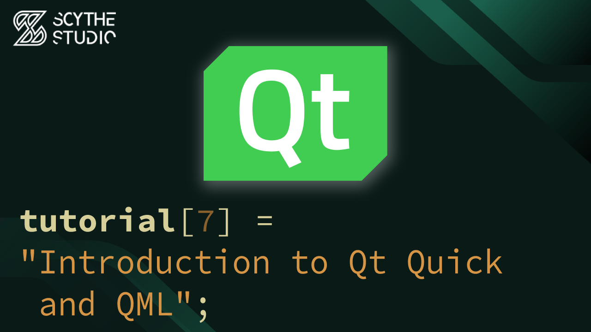

# Introduction to Qt Quick and QML - Qt QML Tutorial #7

## Episode Purpose
In this episode you will be introduced to Qt Quick and QML world. We will explain what QML is and its role in Qt development. The episode will cover the basic syntax of QML, showcase basic UI elements, and explain property bindings. Additionally, we will demonstrate how to use signals and slots in QML, utilizing both handlers and the `Connections` type. Finally, you will explore how to write JavaScript functions within QML.

[Introduction to Qt Quick and QML - Qt QML Tutorial #7 - Watch on YouTube](https://www.youtube.com/watch?v=VPW3y3RVlLw&list=PLP7UmEJ9z4mpi0JXcPS0VRK-7eFAfROZI&index=8)

## Code Short Description
In this coding example, there's a simple QML application with two buttons. The first button prints a message to the console output when clicked, while the second button closes the entire application.

To gain a better understanding of QML's workings, we used a custom button instead of using the built-in QML types. However, note that it is generally recommended to use existing QML types for buttons in real-world scenarios. For the sake of simplicity, we created a basic rectangular button that can change color based on user interactions.

The button consists of a plain rectangle, a `Text` element, and a `MouseArea` element for handling mouse events. Property bindings were utilized to change the button's color when the mouse hovers over it or when it is pressed.

Furthermore, there's a slot that will be invoked when the button is pressed, allowing us to perform custom actions.

To create multiple buttons with different functionalities, we created copies of the button item and defined their respective slots. In future episodes, you will explore how to create such buttons as separate types.

## About Scythe Studio
We are a group of Qt and C++ enthusiasts whose goal is to address growing demand for cross-platform Qt development services. Thanks to our expertise in **Qt Qml development**, quality of deliveries and proven track of projects developed for companies from various industries we have been awarded the title of an official **Qt Service Partner**.

 

The company offers broad spectrum of services for the clients who wish to bring their ideas to life. We have extensive and practical knowledge about various Qt modules and other technologies allowing to create high quality product in a cost effective approach. If you want to see what Scythe Studio is is capable of and what services we provide, check out [this link](https://scythe-studio.com/en/services).

## Follow us

Check out those links if you want to see Scythe Studio in action and follow the newest trends saying about Qt Qml development.

* 🌐 [Scythe Studio Website](https://scythe-studio.com/en/)
* ✍️  [Scythe Studio Blog Website](https://scythe-studio.com/en/blog)
* 👔 [Scythe Studio LinkedIn Profile](https://www.linkedin.com/company/scythestudio/mycompany/)
* 👔 [Scythe Studio Facebook Page](https://www.facebook.com/ScytheStudiio)
* 🎥 [Scythe Studio Youtube Channel](https://www.youtube.com/channel/UCf4OHosddUYcfmLuGU9e-SQ/featured)