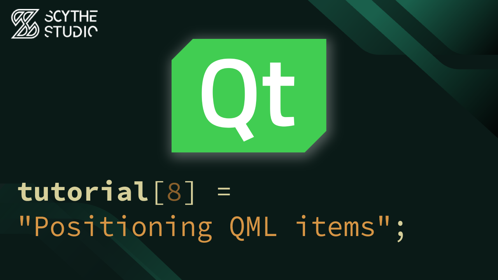

# Positioning in Qt Quick and QML - Qt QML Tutorial #8

## Episode Purpose
In this episode, you will explore different positioning approaches in Qt Quick and QML. The concepts of x&y positioning, anchor positioning, containers (such as Row, Grid, and Column), and layouts will be explained.

This episode provides practical examples to illustrate the different positioning approaches in Qt Quick and QML, helping you understand when and where each technique is most appropriate.

[Positioning in Qt Quick and QML - Qt QML Tutorial #8 - Watch on YouTube](https://www.youtube.com/watch?v=bv3XdeM3a5s&list=PLP7UmEJ9z4mpi0JXcPS0VRK-7eFAfROZI&index=9)

## Code Short Description
In this coding example, an application has been created to simulate a house wall that you want to decorate. The wall is represented as a plain, yellowish surface.

To decorate the wall, paintings in the form of plain rectangles have been hung. Each painting is positioned using a different approach to showcase the various techniques.

A large `GridLayout` with 2 columns and 2 rows serves as the main layout. The grid layout utilizes anchors to fill the window. The paintings are positioned as follows:

- In the top-left cell of the grid, a container item has been placed, and within that container, the picture is positioned using `x` and `y` properties.

- In the top-right cell, another container has been created, and within that container, the picture is positioned using anchors.

- In the bottom-left cell, the `Flow` layout is used to place 5 identical images.

- Finally, in the bottom-right cell, another `GridLayout` is nested to hang 3 more images.

Each cell has been encapsulated in empty Item, so other positioners won't break whole wall.

The use of a `Repeater` item allows for the creation of multiple instances of the same-looking element, in this case, paintings.

## About Scythe Studio
We are a group of Qt and C++ enthusiasts whose goal is to address growing demand for cross-platform Qt development services. Thanks to our expertise in **Qt Qml development**, quality of deliveries and proven track of projects developed for companies from various industries we have been awarded the title of an official **Qt Service Partner**.

 

The company offers broad spectrum of services for the clients who wish to bring their ideas to life. We have extensive and practical knowledge about various Qt modules and other technologies allowing to create high quality product in a cost effective approach. If you want to see what Scythe Studio is is capable of and what services we provide, check out [this link](https://scythe-studio.com/en/services).

## Follow us

Check out those links if you want to see Scythe Studio in action and follow the newest trends saying about Qt Qml development.

* 🌐 [Scythe Studio Website](https://scythe-studio.com/en/)
* ✍️  [Scythe Studio Blog Website](https://scythe-studio.com/en/blog)
* 👔 [Scythe Studio LinkedIn Profile](https://www.linkedin.com/company/scythestudio/mycompany/)
* 👔 [Scythe Studio Facebook Page](https://www.facebook.com/ScytheStudiio)
* 🎥 [Scythe Studio Youtube Channel](https://www.youtube.com/channel/UCf4OHosddUYcfmLuGU9e-SQ/featured)