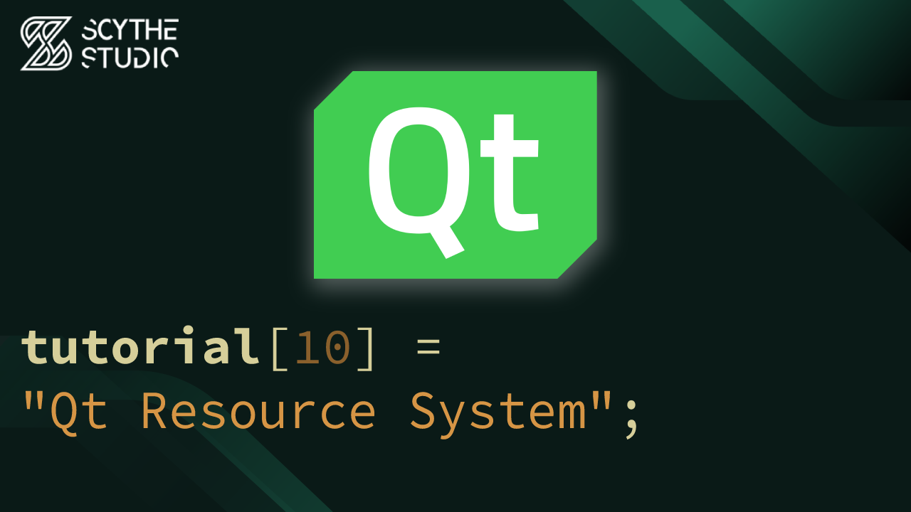

# Qt Resource System and Asset Integration - Qt QML Tutorial #10

## Episode Purpose
In this episode, you will learn about the Qt Resource system and how to integrate assets, such as images and icons, into your Qt QML application. The episode will explain the process of adding images and videos to the app using the `qt_add_qml_module` directive. Additionally, it will cover setting a custom icon for the application's window.

Episode Link: **[YT LINK]**

## Code Short Description
In this coding example, we will continue improving our music player app. Previously, we had a basic version with mocked-up rectangles as song covers and text buttons. Now, we will enhance the app by adding actual covers for the songs and replacing the text buttons with buttons adorned with real icons.

The `rectangle` in AudioInfoBox is replaced with `Image`, as well as appropriate alias name, and all references to old property. Now sources to images are provided instead of colors in `main.qml` file.

Usage of `qt_add_qml_module` directive allows to integrate the added resources into the application, enabling their use within QML components.

Furthermore, we will explore how to set a custom icon for your application's window, with a use of `QCoreApplication::setWindowIcon()`

## About Scythe Studio
We are a group of Qt and C++ enthusiasts whose goal is to address growing demand for cross-platform Qt development services. Thanks to our expertise in **Qt Qml development**, quality of deliveries and proven track of projects developed for companies from various industries we have been awarded the title of an official **Qt Service Partner**.

 

The company offers broad spectrum of services for the clients who wish to bring their ideas to life. We have extensive and practical knowledge about various Qt modules and other technologies allowing to create high quality product in a cost effective approach. If you want to see what Scythe Studio is is capable of and what services we provide, check out [this link](https://scythe-studio.com/en/services).

## Follow us

Check out those links if you want to see Scythe Studio in action and follow the newest trends saying about Qt Qml development.

* 🌐 [Scythe Studio Website](https://scythe-studio.com/en/)
* ✍️  [Scythe Studio Blog Website](https://scythe-studio.com/en/blog)
* 👔 [Scythe Studio LinkedIn Profile](https://www.linkedin.com/company/scythestudio/mycompany/)
* 👔 [Scythe Studio Facebook Page](https://www.facebook.com/ScytheStudiio)
* 🎥 [Scythe Studio Youtube Channel](https://www.youtube.com/channel/UCf4OHosddUYcfmLuGU9e-SQ/featured)