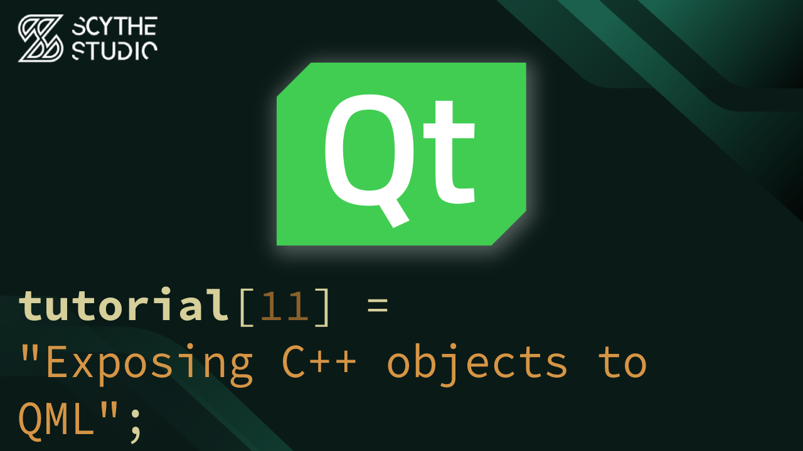

# How to integrate C++ and QML? Exposing C++ objects to QML - Qt QML Tutorial #11

## Episode Purpose
In this episode, you will learn how to expose objects from C++ to QML in Qt. The episode will cover various techniques, including the use of `setContextProperty`, `QML_SINGLETON`, and `qmlRegisterSingletonInstance`. We will explain the differences between these approaches and guide you in choosing the appropriate method for your application. Additionally, you will explore the usage of exposed C++ objects in QML.

Episode Link: **[YT LINK]**

## Code Short Description

In this coding example, we enhance our song player app by implementing the player control logic in C++ instead of QML. To achieve this, we  create a new class called `PlayerController`. Inside this class, we  define `Q_PROPERTIES` such as the current song, song count, and playing state. We will also create slots to control the current playback.

To expose the `PlayerController` object to QML, we will make use of the `qmlRegisterSingletonInstance` function in `main.cpp` file, right before creation of `QQmlEngine`. By doing so, we can remove the existing `QtObject` in QML and replace it with our singleton.

In general the behavior of app didn't change, but we utilized greater separation of logic and UI.

## About Scythe Studio
We are a group of Qt and C++ enthusiasts whose goal is to address growing demand for cross-platform Qt development services. Thanks to our expertise in **Qt Qml development**, quality of deliveries and proven track of projects developed for companies from various industries we have been awarded the title of an official **Qt Service Partner**.

 

The company offers broad spectrum of services for the clients who wish to bring their ideas to life. We have extensive and practical knowledge about various Qt modules and other technologies allowing to create high quality product in a cost effective approach. If you want to see what Scythe Studio is is capable of and what services we provide, check out [this link](https://scythe-studio.com/en/services).

## Follow us

Check out those links if you want to see Scythe Studio in action and follow the newest trends saying about Qt Qml development.

* 🌐 [Scythe Studio Website](https://scythe-studio.com/en/)
* ✍️  [Scythe Studio Blog Website](https://scythe-studio.com/en/blog)
* 👔 [Scythe Studio LinkedIn Profile](https://www.linkedin.com/company/scythestudio/mycompany/)
* 👔 [Scythe Studio Facebook Page](https://www.facebook.com/ScytheStudiio)
* 🎥 [Scythe Studio Youtube Channel](https://www.youtube.com/channel/UCf4OHosddUYcfmLuGU9e-SQ/featured)