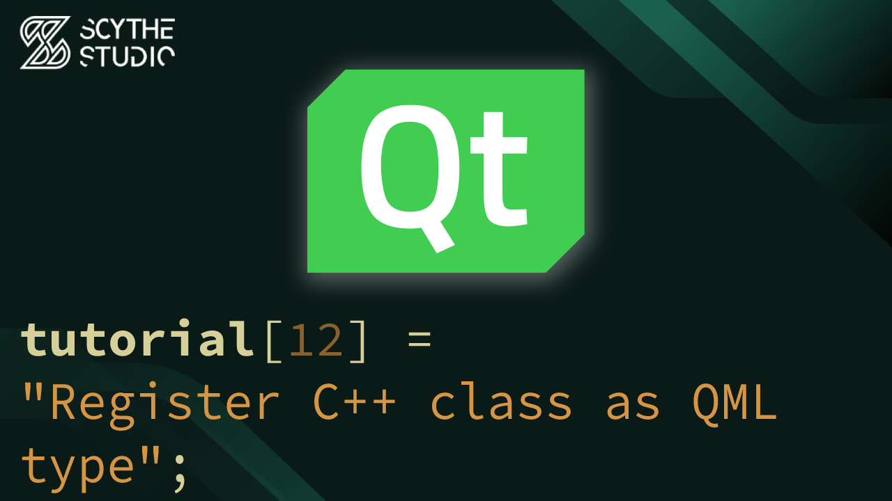

# How to integrate C++ and QML? Register C++ class as QML type - Qt QML Tutorial #12

## Episode Purpose
In this episode, you will explore the process of registering C++ types to QML in Qt. The episode will cover the differences between registering types and exposing objects, the benefits of separating the backend logic from the QML interface, and the various macros available for registering C++ types, such as `QML_ELEMENT`, `QML_NAMED_ELEMENT`, `QML_ANONYMOUS`, `QML_UNCREATABLE`, and `QML_FOREIGN`.

Episode Link: **[YT LINK]**

## Code Short Description
Continuation of developing Spotify-like app.

All properties of the `AudioInfoBox` item are moved to the backend by creating a new class called `AudioInfo`. This class provides additional information about a song, such as its file path, image source, title, and author. Additionally, `PlayerController` class now actually plays the audio using the source as an argument. `QMediaPlayer` class from the Qt Multimedia module is used to achieve this.

To register the `AudioInfo` class to QML, in the CMakeLists file, instead of adding the files directly to the executable, they are included inside the `qt_add_qml_module` directive under the `SOURCES` keyword.

Next, to make the `AudioInfo` type creatable in QML, the `QML_ELEMENT` macro has been added to our new class.

By registering the `AudioInfo` class, we can use it as a QML element in the `AudioInfoBox` item and benefit from the separation of backend logic and QML interface.

## About Scythe Studio
We are a group of Qt and C++ enthusiasts whose goal is to address growing demand for cross-platform Qt development services. Thanks to our expertise in **Qt Qml development**, quality of deliveries and proven track of projects developed for companies from various industries we have been awarded the title of an official **Qt Service Partner**.

 

The company offers broad spectrum of services for the clients who wish to bring their ideas to life. We have extensive and practical knowledge about various Qt modules and other technologies allowing to create high quality product in a cost effective approach. If you want to see what Scythe Studio is is capable of and what services we provide, check out [this link](https://scythe-studio.com/en/services).

## Follow us

Check out those links if you want to see Scythe Studio in action and follow the newest trends saying about Qt Qml development.

* 🌐 [Scythe Studio Website](https://scythe-studio.com/en/)
* ✍️  [Scythe Studio Blog Website](https://scythe-studio.com/en/blog)
* 👔 [Scythe Studio LinkedIn Profile](https://www.linkedin.com/company/scythestudio/mycompany/)
* 👔 [Scythe Studio Facebook Page](https://www.facebook.com/ScytheStudiio)
* 🎥 [Scythe Studio Youtube Channel](https://www.youtube.com/channel/UCf4OHosddUYcfmLuGU9e-SQ/featured)