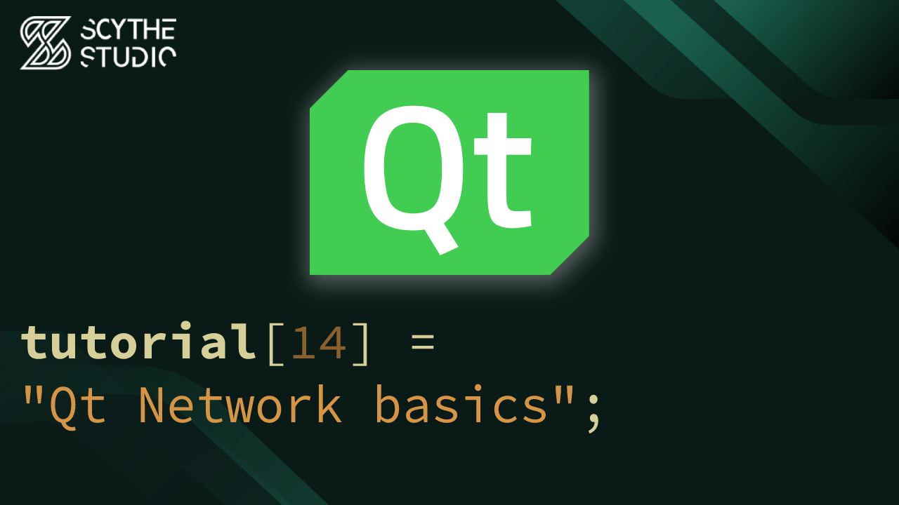

# Qt Network Basics and REST API Client Example - Qt QML Tutorial #14

## Episode Purpose
In this episode, you will explore the process of registering C++ types to QML in Qt. The episode will cover the differences between registering types and exposing objects, the benefits of separating the backend logic from the QML interface, and the various macros available for registering C++ types, such as `QML_ELEMENT`, `QML_NAMED_ELEMENT`, `QML_ANONYMOUS`, `QML_UNCREATABLE`, and `QML_FOREIGN`.

[Qt Network Basics and REST API Client Example - Qt QML Tutorial #14 - Watch on YouTube](https://www.youtube.com/watch?v=wzqd9Nt6ohM&list=PLP7UmEJ9z4mpi0JXcPS0VRK-7eFAfROZI&index=15)

## Code Short Description

REST API client has been implemented, providing the ability to search for songs and play them directly within the app. 

To establish communication with the REST API, we used `QNetworkAccessManager` instance to handle the requests. Then a `QNetworkRequest` object was created with the necessary details, such as the API's URL, and use the `get()` or `post()` functions of `QNetworkAccessManager` to send the request. 

The response is then stored as a `QNetworkReply` pointer, and thanks to the `finished()` signal of `QNetworkAccessManager`, we can handle the response when it is ready.

The responses are in JSON format, so we are also using Qt's JSON utility classes, including `QJsonDocument`, `QJsonObject`, and `QJsonArray`.

To store search results, and manage requests, we created custom `AudioSearchModel` model class. This model is populated with data retrieved from the REST API, and we use it to display the search results in a `ListView` in QML. The search functionality triggered by a button click, and the selected song from the search results can be added to the playlist for playback.

To search for songs, we used free to use Jamendo API, which can be found here: https://developer.jamendo.com/v3.0/docs

## About Scythe Studio
We are a group of Qt and C++ enthusiasts whose goal is to address growing demand for cross-platform Qt development services. Thanks to our expertise in **Qt Qml development**, quality of deliveries and proven track of projects developed for companies from various industries we have been awarded the title of an official **Qt Service Partner**.

 

The company offers broad spectrum of services for the clients who wish to bring their ideas to life. We have extensive and practical knowledge about various Qt modules and other technologies allowing to create high quality product in a cost effective approach. If you want to see what Scythe Studio is is capable of and what services we provide, check out [this link](https://scythe-studio.com/en/services).

## Follow us

Check out those links if you want to see Scythe Studio in action and follow the newest trends saying about Qt Qml development.

* 🌐 [Scythe Studio Website](https://scythe-studio.com/en/)
* ✍️  [Scythe Studio Blog Website](https://scythe-studio.com/en/blog)
* 👔 [Scythe Studio LinkedIn Profile](https://www.linkedin.com/company/scythestudio/mycompany/)
* 👔 [Scythe Studio Facebook Page](https://www.facebook.com/ScytheStudiio)
* 🎥 [Scythe Studio Youtube Channel](https://www.youtube.com/channel/UCf4OHosddUYcfmLuGU9e-SQ/featured)