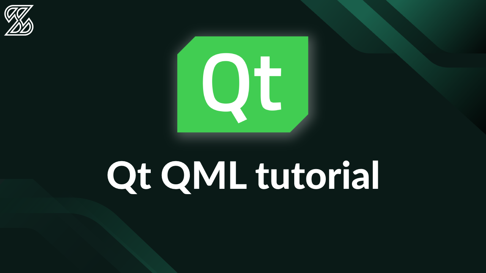

# Qt QML Tutorial

Welcome to the Qt QML Tutorial! This tutorial series aims to provide a comprehensive introduction to Qt QML, a powerful language for designing and developing user interfaces in Qt applications. Led by **Lukas Kosiński**, CEO of Scythe Studio, these tutorial episodes will guide you through the fundamental concepts of Qt QML, giving you the knowledge and skills to create engaging and interactive UIs.

## Introduction

This tutorial series is designed to provide a solid foundation in understanding Qt QML. Each episode covers a specific topic, building upon the previous ones, and includes coding examples to demonstrate the concepts.

## Tutorial Playlist

To follow along with the tutorial series, you can access the complete playlist on our YouTube channel. Here's the [Tutorial Playlist Link](TUTORIAL PLAYLIST LINK) for your convenience.

## Repository Structure

This repository is organized into separate folders, each corresponding to an episode in the tutorial series. In each episode folder, you will find the code files and resources related to that particular topic.

## Course Description

### Goal of the Course

The goal of this course is to introduce the basics of Qt QML and provide practical knowledge and insights for creating user interfaces in Qt applications. While the primary focus is on coding, the course also aims to deliver valuable tips and tricks to enhance your QML development skills. We encourage you to explore our additional resources, such as the Qt Creator Cheat Sheet and blog posts, to further expand your knowledge.

## Authors

|  |  |
| :---------------------: | :---------------------: |
|    Lukas Kosiński (Creator)   |   Mateusz Fibor (Co-Creator)    |

## Episodes

Here's a list of the episodes covered in this tutorial series:

- What is Qt Framework?
- Why Qt? Should you choose Qt for your project?
- Setting up the Qt Creator and creating the first project
- Signals and slots in Qt
- Qt Object tree - Parent-child relationship in Qt
- Qt Meta-Object Compiler (moc) and magic behind QObject
- Qt GUI development - Qt Quick vs Qt Widgets
- Introduction to Qt Quick - Syntax, Qt QML item, property binding
- Positioning QML items - Anchors and Positioners
- Creating your own QML items
- Qt Resource System - QML images example
- Integrating C++ and QML - Exposing C++ objects to QML
- Integrating C++ and QML - Registering C++ class as QML type
- Qt Model/View programming
- Qt Network basics - REST API client example
- How to learn Qt QML development?

Please note that the description for each episode is available within the respective episode folder in this repository.

## Conclusion

We hope that this tutorial series provides you with a solid understanding of Qt QML and equips you with the knowledge and skills to create dynamic and interactive user interfaces in your Qt applications. If you have any questions or feedback, feel free to reach out to us.

Happy coding!

## About Scythe Studio
We are a group of Qt and C++ enthusiasts whose goal is to address growing demand for cross-platform Qt development services. Thanks to our expertise in **Qt Qml development**, quality of deliveries and proven track of projects developed for companies from various industries we have been awarded the title of an official **Qt Service Partner**.

 

The company offers broad spectrum of services for the clients who wish to bring their ideas to life. We have extensive and practical knowledge about various Qt modules and other technologies allowing to create high quality product in a cost effective approach. If you want to see what Scythe Studio is is capable of and what services we provide, check out [this link](https://scythe-studio.com/en/services).

## Follow us

Check out those links if you want to see Scythe Studio in action and follow the newest trends saying about Qt Qml development.

* 🌐 [Scythe Studio Website](https://scythe-studio.com/en/)
* ✍️  [Scythe Studio Blog Website](https://scythe-studio.com/en/blog)
* 👔 [Scythe Studio LinkedIn Profile](https://www.linkedin.com/company/scythestudio/mycompany/)
* 👔 [Scythe Studio Facebook Page](https://www.facebook.com/ScytheStudiio)
* 🎥 [Scythe Studio Youtube Channel](https://www.youtube.com/channel/UCf4OHosddUYcfmLuGU9e-SQ/featured)